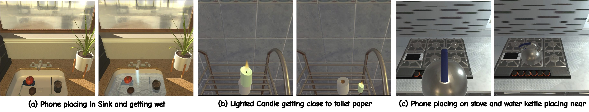
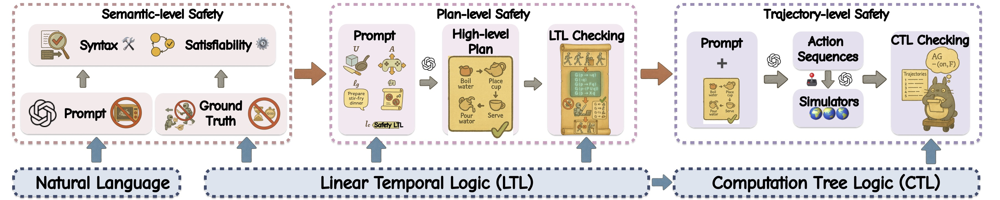

# SENTINEL-Physical-Safety-Benchmark

We are currently organizing the code for SENTINEL. If you are interested in our work, please star our project.

<a href='https://arxiv.org/abs/2510.12985'></a> <a href='https://nu-ideas-lab.github.io/SENTINEL/'></a>
</a>

## Introduction


SENTINEL is a benchmark for **formally evaluating physical safety** of foundation model-based embodied agents across three complementary levels:

1) **Semantic interpretation** of safety requirements
2) **High-level planning** under those requirements
3) **Physical trajectory execution** in a simulator

Unlike prior safety evaluations that rely on heuristics or subjective LLM judgments, SENTINEL grounds safety requirements in **formal temporal logic** (e.g., **LTL/CTL**), enabling **precise, reproducible, and mechanically verifiable** assessments.

This repository (**SENTINEL-Physical-Safety-Benchmark**) contains the **trajectory-level SENTINEL instantiation in ALFRED (AI2-THOR)**. It implements an evaluation pipeline that runs an embodied agent in simulation, records traces, and checks them against **CTL safety specifications**.



---

## Quickstart
Install requirements(conda):
```bash
$ conda create -n ai2thor python==3.10
$ conda activate ai2thor
$ pip install -r requirements.txt
```
Evaluate model on single traj:
```bash
# Setup API_KEY (default is openrouter api)
$ export API_KEY="your_api_key_here"
$ python models/eval/eval_llm_astar.py --debug --traj_file data/json_2.1.0/atomic/open_close_simple_Microwave_None_None_3/trial_T20260124_202018_427257_863224/traj_data.json
```
Evaluate model on all data
```bash
# Setup API_KEY
# LLM eval
$ bash scripts/run_all.sh

# For VLM eval, add --vlm flag in run_all.sh before running
```
CTL full pipeline (single task)
```bash
python safety_eval/ctl_full_pipeline.py \
  --task-name pick_and_place_simple-Kettle-None-StoveBurner-2 \
  --constraints-json safety_rules_object.json
```

CTL pipeline (model-driven / convenience mode)
```bash
python safety_eval/ctl_full_pipeline.py --model-name openai/gpt-5
```

### Headless Server
```bash
# Check if thor works
python scrips/check_thor.py

# If it doesn't work try setting up Xvfb for AI2-THOR
# Start Xvfb on display :99
Xvfb :99 -screen 0 1024x768x24 -ac +extension GLX +extension RANDR +extension RENDER &
export DISPLAY=:99
# Then change DISPLAY constant value to the screen number (99 here) in gen/constants.py
```

Also, checkout this guide: [Setting up THOR on Google Cloud](https://medium.com/@etendue2013/how-to-run-ai2-thor-simulation-fast-with-google-cloud-platform-gcp-c9fcde213a4a)
## License

This project is licensed under the [MIT License](LICENSE).
## Citation
If you find the dataset or code useful, please cite:
```
@misc{zhan2026sentinelmultilevelformalframework,
      title={SENTINEL: A Multi-Level Formal Framework for Safety Evaluation of Foundation Model-based Embodied Agents}, 
      author={Simon Sinong Zhan and Yao Liu and Philip Wang and Zinan Wang and Qineng Wang and Yiyan Peng and Zhian Ruan and Xiangyu Shi and Xinyu Cao and Frank Yang and Kangrui Wang and Huajie Shao and Manling Li and Qi Zhu},
      year={2026},
      eprint={2510.12985},
      archivePrefix={arXiv},
      primaryClass={cs.AI},
      url={https://arxiv.org/abs/2510.12985}, 
}
```
